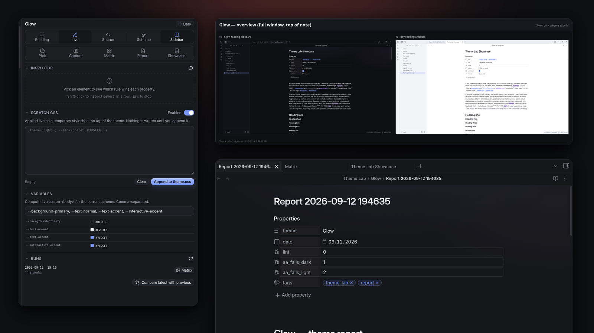
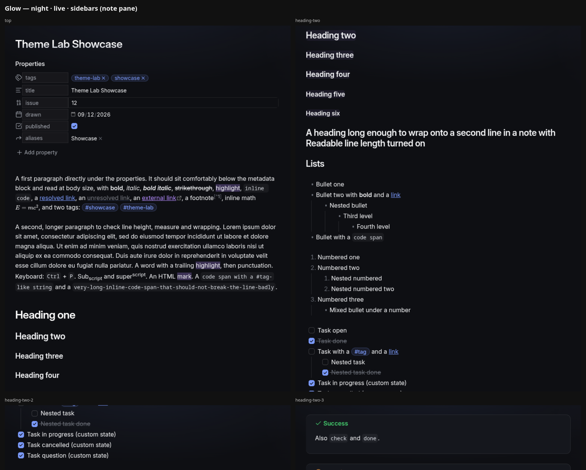
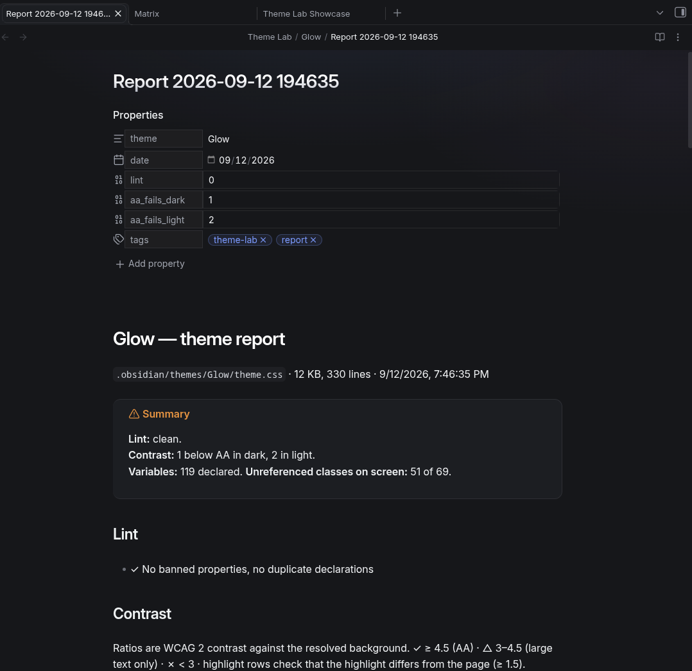
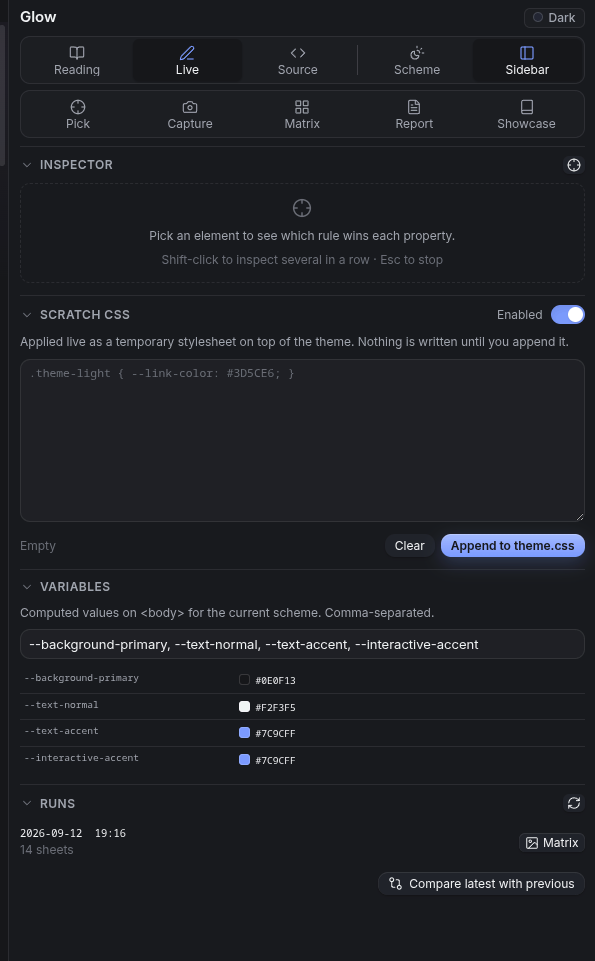
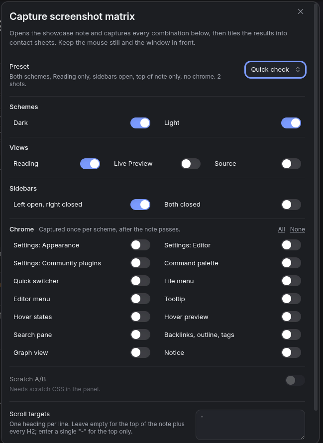

# Theme Lab

**Build Obsidian themes from inside the app.** Click any element and see which CSS rule wins. Capture every scheme × view × sidebar combination into contact sheets. Lint, contrast-check and inventory a theme in one report. Try CSS live, diff the screenshots, then append it to the theme.

[](https://real-fruit-snacks.github.io/obsidian-theme-lab/)
[](https://github.com/Real-Fruit-Snacks/obsidian-theme-lab/releases/latest)
[](LICENSE)



Theme Lab replaces the loop of *edit CSS → reload → screenshot → squint → repeat* that every theme author knows. It was built to ship [Glow](https://github.com/Real-Fruit-Snacks/obsidian-glow), [Outrun](https://github.com/Real-Fruit-Snacks/obsidian-outrun), [Dossier](https://github.com/Real-Fruit-Snacks/obsidian-dossier), [Comic](https://github.com/Real-Fruit-Snacks/obsidian-comic) and [Grimoire](https://github.com/Real-Fruit-Snacks/obsidian-grimoire).

## What it does

### Inspect element

Click anything in the workspace and get a report: the DOM path with every class, the element's HTML with children pruned, the computed values that matter, and *every stylesheet rule that matches it* with specificity, origin (app.css, your theme, a plugin) and a ★ on the declaration that actually won each property. The variables those rules reference are listed with their computed values. It's the answer to "why didn't my rule apply?" in one click. Shift-click to inspect several elements in a row; Esc to stop.

### Screenshot matrix

Opens the showcase note and captures every combination of **scheme** (dark, light) × **view** (Reading, Live Preview, Source) × **sidebars** (open, closed) at the top of the note and at every H2 — paging down when a section is taller than the window, so nothing between headings is missed. Then it captures the chrome: three Settings tabs, the command palette, quick switcher, file and editor context menus, a tooltip, hover states, a hover preview, the search pane, the right sidebar, graph view and a notice, in both schemes.

Every capture is saved as a full-window PNG, a 1200×800 listing crop centred on the note, and a 1920-wide hero. Everything is tiled into labelled **contact sheets** — one per scheme × view × sidebars, an overview, and one for the chrome — so a hundred captures become a dozen images you can actually review, or hand to someone else to review.



Presets cover the usual runs: **Full review**, **Quick check** (two shots), **Editor pass**, **Chrome only**, and **Artwork** (the two captures a community listing needs). Anything a core plugin would need is skipped and named in the run's `Matrix.md` instead of producing a blank tile.

### Showcase note

Creates a note that exercises everything a theme has to style: properties of every type, all inline formatting, six heading levels and a wrapping one, nested bullets, numbered and mixed lists, tasks with custom states, all thirteen callout types plus collapsed, expanded, nested, long-title and custom ones, a blockquote, four kinds of code block, an aligned table, rules, embeds, math, Mermaid, a comment, raw HTML, a footnote — and a checklist of the chrome that isn't in a note. A readable copy is in [`showcase.md`](showcase.md).

### Theme report

One note with a summary at the top: the lint the community review runs (banned properties, duplicate declarations), a WCAG contrast table for the important text/background pairs in **both schemes side by side**, every variable the theme declares with its computed dark and light values, which variables are declared in one scheme only, and the Obsidian classes currently on screen that the theme's CSS never mentions.



### The panel

A right-sidebar panel with the view switcher, scheme and sidebar toggles, the five tools, a live inspector, **Scratch CSS** (applied instantly as a temporary stylesheet, persisted, and appended to `theme.css` under a dated comment when you're happy with it), a variable watch with colour swatches, and the list of matrix runs with their Matrix and Diff notes.

Two things make the scratch pad more than a text box: **Scratch A/B** captures every shot of a matrix run with the scratch CSS off and on and diffs the pairs into a change sheet, and **Compare latest with previous** diffs two runs capture by capture so you can see exactly what a theme change touched.

<p>


</p>

## Install

**Community plugins** — Settings → Community plugins → Browse → search "Theme Lab".

**Manually** — download `main.js`, `styles.css` and `manifest.json` from the [latest release](https://github.com/Real-Fruit-Snacks/obsidian-theme-lab/releases/latest) into `<vault>/.obsidian/plugins/theme-lab/`, then enable it under Community plugins.

Desktop only: screenshots use Electron's `capturePage`, and the real pointer and right-click events that make hover states and context menus appear.

## Use

1. **Theme Lab: Create or open the showcase note.** Read it once in each view; it's the checklist.
2. **Theme Lab: Capture screenshot matrix.** Pick a preset, leave the window alone for a minute, then open `Matrix.md` in the run folder and look at the sheets.
3. When something looks wrong, **Theme Lab: Inspect element** (or the flask in the ribbon), click the thing, and read the panel — or paste the copied report into your notes or an issue.
4. Write the fix in **Scratch CSS**, watch it apply, re-run the matrix with **Scratch A/B** to see what changed, then **Append to theme.css**.
5. Before a release, **Theme Lab: Write theme report** and clear the Lint section. The contrast table is advisory; the unreferenced-class list is a prompt, not a to-do list.

**Capture one screenshot now** saves a single shot of the current window with the same crops, and **Toggle dark/light scheme** is there so you can bind it to a key.

## Where things go

```
Theme Lab/
  Glow/
    2026-09-12 194652/     one folder per matrix run
      Matrix.md            the sheets, embedded, with anything skipped
      sheets/              contact sheets — send these
      shots/               every capture: -full, -3x2 (listing), -hero (1920 wide)
      diff-vs-previous/    when you compare runs
    captures/              "Capture one screenshot now"
    Report 2026-09-12 …md  theme reports
    Inspect 2026-09-12 …md inspect reports, if saving is on
  Outrun/
    …
```

Runs never overwrite each other; delete a run folder when you're done with it.

## Settings

The showcase note's name and a reset button; settle time between state changes (raise it if shots catch a transition); whether Readable line length is forced on during captures; which pane the left sidebar shows; the output folder; whether to write the listing and hero crops; and whether inspect reports are also saved as notes.

## Notes

- The inspector's specificity is computed by the plugin and is close to, not identical with, the browser's; `:is()` and `:where()` are approximated.
- Native `<select>` dropdowns render in an OS window and can't be captured open.
- The quick switcher and hover preview captures need those core plugins enabled; if they're off the captures are skipped and listed in `Matrix.md`.
- Everything is read-only apart from the files it writes into the output folder, the showcase note, and — only when you press the button — the theme's `theme.css`.

## Contributing

See [CONTRIBUTING.md](CONTRIBUTING.md). No build step: `main.js`, `styles.css`, `manifest.json`. The showcase text lives in `main.js` with a readable copy in `showcase.md`.

## License

[MIT](LICENSE).
